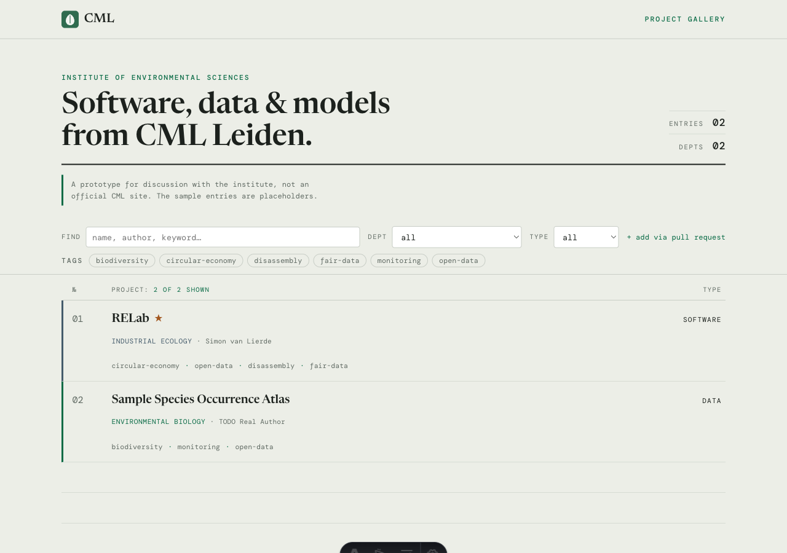

# CML Project Gallery

[](https://github.com/CMLPlatform/cml-gallery/actions/workflows/ci.yml)
[](https://github.com/CMLPlatform/cml-gallery/actions/workflows/deploy.yml)
[](https://astro.build)
[](LICENSE)

A prototype public gallery for the software, data, and models built at the
**Institute of Environmental Sciences (CML)**, Leiden University, so colleagues
can showcase their work in one place.

**Live demo: [cmlplatform.github.io/cml-gallery](https://cmlplatform.github.io/cml-gallery/)**

[](https://cmlplatform.github.io/cml-gallery/)

> **Proposal-stage prototype.** Built to demonstrate an approach for discussion with the institute. It is **not an official CML site**, and the two sample projects are clearly marked placeholders.

## The idea

Contribution should be as cheap as possible. Adding a project is **one templated
Markdown file and a pull request** — no CMS, no login, no touching the site's
code. The site stays low-maintenance, and every change goes through normal Git
review.

The file *is* the contract: each entry is validated at build time against a typed
schema ([`src/content.config.ts`](src/content.config.ts)), so a malformed entry
fails the build with a clear message instead of shipping a broken card.

## Add a project

Copy [`_TEMPLATE.md`](src/content/projects/_TEMPLATE.md), fill it in, open a PR.
Full instructions: **[CONTRIBUTING.md](CONTRIBUTING.md)**.

## Run locally

Requires **Node 22.12+** (Astro 7).

```bash
npm install
npm run dev      # dev server with hot reload
npm run build    # production build to dist/ — also validates every entry
npm run preview  # serve the production build
npm run check    # astro check (types)
npm test         # unit tests
```

## Project layout

| Path | What it is |
| ---- | ---------- |
| [`src/content.config.ts`](src/content.config.ts) | The Zod schema — the ingestion contract. |
| [`src/content/projects/`](src/content/projects/) | One Markdown file per project. `_TEMPLATE.md` is the template. |
| [`src/pages/index.astro`](src/pages/index.astro) | Landing page: searchable, filterable project list. |
| [`src/pages/projects/[slug].astro`](src/pages/projects/) | Per-project detail page. |
| [`src/components/`](src/components/), [`src/scripts/filter.js`](src/scripts/filter.js) | Entry rows, filter bar, and the vanilla-JS filtering. |
| [`.github/workflows/`](.github/workflows/) | CI, deploy to GitHub Pages, optional ingestion. |

### Design notes

- **Astro static site**, typed content collections, **zero client framework**.
  Filtering and search are plain DOM over the server-rendered list, so the
  gallery still works with JavaScript disabled.
- **Accessible by default:** semantic HTML, labelled and keyboard-navigable
  filters, visible focus, WCAG-AA contrast, and colourblind-safe (Okabe-Ito)
  category colours that are always paired with text.
- **Fonts are self-hosted** (`@fontsource`), so the site makes no third-party
  requests — relevant for an EU institute.
- Images are lazy-loaded.

## Deploy

[`.github/workflows/deploy.yml`](.github/workflows/deploy.yml) builds and
publishes to **GitHub Pages** on every push to `main`.

Before the first deploy:

1. Set the URL in [`astro.config.mjs`](astro.config.mjs). Project site
   (`https://<org>.github.io/<repo>`): set `site` and `base: '/<repo>/'`. User/org
   site or custom domain: set `base: '/'`.
2. In repository settings, set **Pages → Build and deployment → Source** to
   **GitHub Actions**.

For Cloudflare Pages instead: build command `npm run build`, output directory
`dist/`. No Cloudflare config is included here.

## Optional: automated ingestion

Hand-authored entries are the primary path. As an **optional** supplement, a
build-time script can surface repositories automatically:

```bash
npm run ingest                                   # write new drafts
node scripts/fetch-github-projects.mjs --dry-run # preview without writing
```

[`scripts/fetch-github-projects.mjs`](scripts/fetch-github-projects.mjs) fetches
public repositories in the `CMLPlatform` org that carry the **`cml-showcase`**
topic and writes one draft entry per repo, derived from its description,
homepage, topics, and README excerpt.

Two safeguards:

- Every generated entry gets **`draft: true`**, so it is **excluded from the
  built site** until a maintainer reviews it, fills in the TODO fields
  (`department`, `authors`), and removes the flag.
- **Existing files are never overwritten:** a repo is skipped if `<repo-name>.md`
  already exists. This is also why a promoted draft should keep its filename —
  rename it, and the next run re-drafts that repo. The duplicate arrives as a
  draft for review, so no harm done, but it is noise.

[`.github/workflows/ingest.yml`](.github/workflows/ingest.yml) runs this weekly
(and on demand) and opens a pull request with any new drafts, so review happens
through the same PR flow as everything else. Delete that workflow for
hand-curation only.

## Context

This prototype is meant to start a conversation about shared research
infrastructure at CML. It overlaps with an AI4IE web-apps showcase, which could
later reuse the same template-and-PR ingestion approach.

## License

[MIT](LICENSE).
